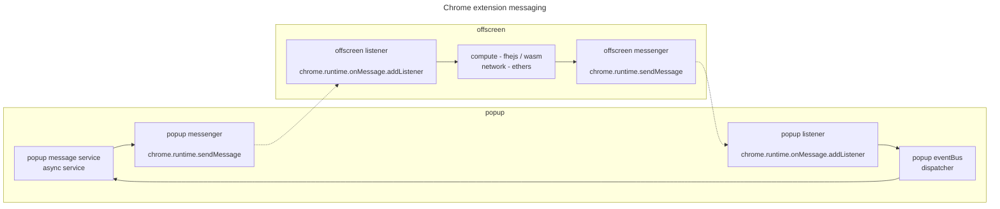

Messenger components
messenger.service abstracts communication with the offscreen page and offers a standard async interface.

```mermaid

---
title: Chrome extension messaging
---
flowchart LR
    service[
      popup message service
      async service
    ]
    eventBus[
      popup eventBus
      dispatcher
    ]
    popupListener[popup listener
    chrome.runtime.onMessage.addListener]
    popupMessenger[
      popup messenger
      chrome.runtime.sendMessage
    ]

    offscreenListener[
      offscreen listener
      chrome.runtime.onMessage.addListener
    ]
    compute[
      compute - fhejs / wasm
      network - ethers
    ]
    offscreenMessenger[
      offscreen messenger
      chrome.runtime.sendMessage
    ]

    subgraph popup
    service --> popupMessenger
    popupListener --> eventBus --> service
    end

    subgraph offscreen
    offscreenListener --> compute --> offscreenMessenger
    end

    popupMessenger -.->  offscreenListener
    offscreenMessenger  -.->  popupListener

```
